# YouTube Music Premium+ — Detailed Technical Specification

**Companion to:** [PRD-YouTube-Music-Premium-Plus.md](/git/PRD-YouTube-Music-Premium-Plus.md)
**Status:** Draft v1.0
**Last Updated:** 2026-08-05

This document expands each pillar with: detailed user stories (Given/When/Then), functional & non-functional requirements, acceptance criteria, technical architecture, and UX flows. Diagrams use Mermaid syntax.

---

# Table of Contents
1. Pillar 1 — Hear Better
2. Pillar 2 — Know More
3. Pillar 3 — Move Better
4. Cross-Cutting — Pixel Integration
5. Cross-Cutting — Premium+ Subscription & Entitlements
6. Global Technical Architecture
7. Cross-Cutting NFRs (Security, Privacy, Observability)

---

# 1. Pillar 1 — Hear Better

## 1.1 Detailed User Stories

### US-1.1: Select streaming quality
**As a** Premium+ subscriber
**I want to** manually choose my streaming quality (Data Saver / High / Lossless / Hi-Res)
**So that** I can control audio fidelity vs. data usage.

- **Given** I am a Premium+ subscriber on the Settings > Audio Quality screen
- **When** I select "Hi-Res"
- **Then** the setting is saved to my account profile and applied on this and all other signed-in devices
- **And** if my current network is cellular, I see a confirmation dialog warning about data usage before the setting takes effect

### US-1.2: Auto-detect Hi-Res capable hardware
**As a** Premium+ subscriber who just plugged in a USB DAC
**I want to** be notified that my device supports Hi-Res Audio
**So that** I don't have to know about the feature to benefit from it.

- **Given** I am playing a song at "High" quality
- **When** I connect a recognized Hi-Res-capable DAC or wired headphone
- **Then** within 5 seconds a non-intrusive banner appears: "Your device supports Hi-Res Audio — Switch now"
- **And** tapping it switches playback to Hi-Res without restarting the current track (seamless codec switch)
- **And** dismissing it suppresses the prompt for that device for 7 days

### US-1.3: Adaptive downgrade on bandwidth drop
**As a** Premium+ subscriber streaming Hi-Res on a train
**I want to** have playback automatically adjust quality when my connection weakens
**So that** my music doesn't stop or stutter.

- **Given** I am streaming at Hi-Res quality
- **When** measured throughput falls below the Hi-Res sustain threshold for >3 seconds
- **Then** the client seamlessly steps down to Lossless, then AAC as needed, with no audible gap >250ms
- **And** a subtle UI indicator shows the current active quality (not a blocking dialog)
- **And** when bandwidth recovers and is stable for 10 seconds, the client steps back up automatically

### US-1.4: Download in FLAC/Hi-Res for offline
**As a** Premium+ subscriber preparing for a flight
**I want to** download albums in FLAC or Hi-Res
**So that** I can listen offline at full quality.

- **Given** I am viewing an album/playlist detail screen
- **When** I tap Download and choose "Hi-Res" from the quality picker
- **Then** the app shows estimated storage size before confirming
- **And** the download proceeds over Wi-Fi only by default (cellular requires explicit override in Settings)
- **And** downloaded tracks play back offline at the selected quality, verified via the Now Playing audio info panel

### US-1.5: View real-time audio diagnostics
**As an** audiophile
**I want to** see the current bitrate, sample rate, codec, and output device
**So that** I can verify I'm getting the quality I'm paying for.

- **Given** I am playing any track
- **When** I open the "Audio Info" panel from Now Playing
- **Then** I see live values for: codec (e.g., FLAC), sample rate (e.g., 96kHz), bit depth (e.g., 24-bit), bitrate, and active output device name
- **And** values update within 1 second of any output device change (e.g., unplugging headphones)

## 1.2 Functional Requirements (Detailed)

| ID | Requirement |
|---|---|
| FR-1.01 | Support playback of AAC, Opus, FLAC (16-bit/44.1kHz), and Hi-Res FLAC (24-bit up to 192kHz) |
| FR-1.02 | Provide 4 user-selectable quality modes: Data Saver, High, Lossless, Hi-Res |
| FR-1.03 | Detect connected audio output type: internal DAC, external/USB DAC, wired 3.5mm/USB-C headphones, Bluetooth (and negotiated codec: SBC, AAC, aptX, aptX HD, LDAC) |
| FR-1.04 | Detect device DAC chipset capability via platform APIs (Android AudioManager / iOS AVAudioSession equivalents) |
| FR-1.05 | Surface contextual "Hi-Res supported" recommendation banner on capable-hardware connection |
| FR-1.06 | Support quality-specific offline downloads (Standard, High, FLAC, Hi-Res) with pre-download storage size estimate |
| FR-1.07 | Adaptive bitrate engine: monitor throughput/buffer health and step Hi-Res ↔ Lossless ↔ AAC automatically |
| FR-1.08 | Display live audio diagnostics panel (codec, sample rate, bit depth, bitrate, output device) |
| FR-1.09 | Persist quality preference per user account, synced across devices |
| FR-1.10 | Gate Hi-Res/Lossless streaming to Wi-Fi by default; require explicit opt-in for cellular |
| FR-1.11 | Catalog metadata must expose per-track quality availability (not all tracks will have Hi-Res masters) |

## 1.3 Non-Functional Requirements (Detailed)

| ID | Category | Requirement |
|---|---|---|
| NFR-1.01 | Latency | Tap-to-play startup latency < 2 sec (P95) across all quality modes |
| NFR-1.02 | Reliability | Buffering ratio < 1% of total playback time |
| NFR-1.03 | Availability | 99.9% streaming service availability (measured monthly) |
| NFR-1.04 | Seamlessness | Quality transitions (manual or adaptive) must not produce audible gap > 250ms or a click/pop artifact |
| NFR-1.05 | Scalability | Encoding pipeline must support Hi-Res FLAC generation for the full active catalog without backlog > 24h for new releases |
| NFR-1.06 | Storage | CDN edge caching must support large FLAC/Hi-Res file sizes (est. 5–10x AAC) without degrading cache hit ratio below current baseline |
| NFR-1.07 | Device compatibility | Hardware detection must cover ≥ 95% of DAC/headphone models represented in user hardware telemetry |
| NFR-1.08 | Battery | Hi-Res decode/playback must not increase battery drain by more than 15% vs. AAC baseline on reference devices |

## 1.4 Acceptance Criteria Summary

- [ ] All 4 quality modes selectable and persisted account-wide
- [ ] Hi-Res hardware detection banner appears within 5s of connection, ≥95% detection accuracy
- [ ] Adaptive engine transitions without audible artifact in ≥ 99% of induced-bandwidth-drop test cases
- [ ] Offline downloads available in all 4 quality tiers with accurate storage estimates (±10%)
- [ ] Audio diagnostics panel reflects real-time state within 1 second of change
- [ ] P95 startup latency < 2s validated across 3 network conditions (Wi-Fi, 4G, 5G)

## 1.5 Technical Architecture

### 1.5.1 Component Overview

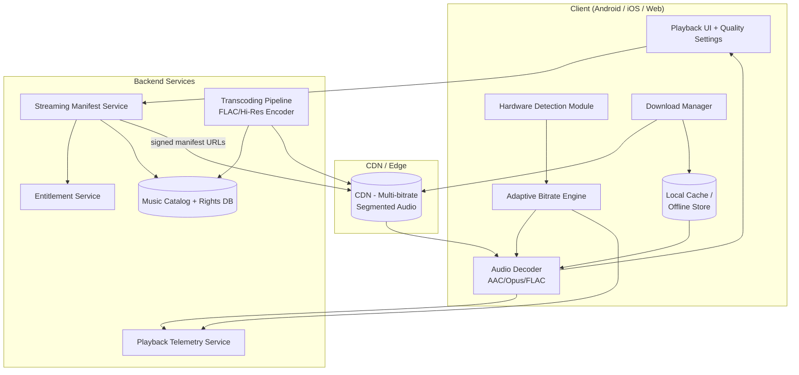

### 1.5.2 Sequence: Adaptive Quality Switch

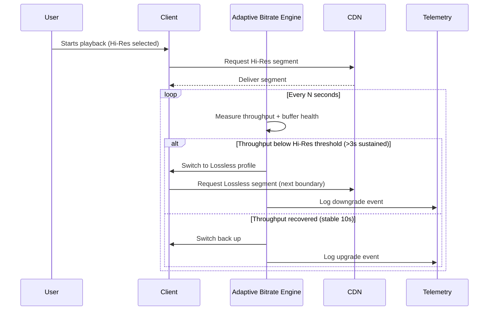

### 1.5.3 Data Model (Key Entities)
```
Track {
  track_id, title, artist_id, album_id,
  available_qualities: [AAC, OPUS, FLAC, HIRES_FLAC],
  hires_sample_rate, hires_bit_depth,
  rights_flags: { lossless_licensed: bool, region_restrictions: [...] }
}

PlaybackManifest {
  track_id, quality_profiles: [ {codec, bitrate, sample_rate, segment_urls[]} ],
  signed_url_expiry
}

UserAudioPreference {
  user_id, selected_quality_mode, cellular_hires_opt_in: bool, per_device_overrides
}

DownloadRecord {
  user_id, track_id, quality, file_size_bytes, download_state, local_path
}
```

### 1.5.4 Key APIs (Illustrative)
- `GET /v1/playback/manifest?track_id={id}&quality={mode}` → signed CDN manifest URLs per quality profile
- `GET /v1/device/audio-capabilities` (client-reported) → used server-side for analytics + recommendation logic
- `POST /v1/downloads` `{track_id, quality}` → initiates download job, returns size estimate
- `POST /v1/telemetry/playback-quality-event` → logs upgrade/downgrade/buffering events

## 1.6 UX Flows

### Flow A: Discovering & Enabling Hi-Res
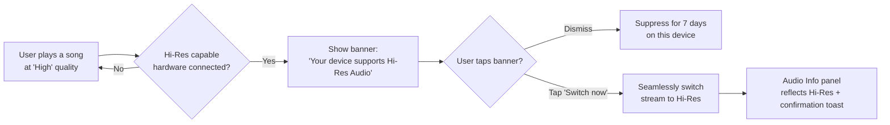

### Flow B: Downloading for Offline at Chosen Quality
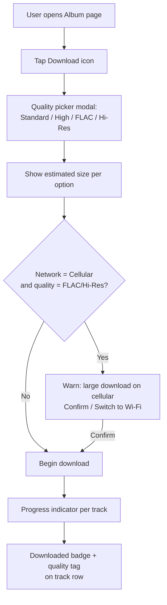

### Screen Inventory
| Screen | Purpose |
|---|---|
| Settings > Audio Quality | Select global default streaming quality mode |
| Now Playing > Audio Info panel | Real-time codec/bitrate/sample rate/output device display |
| Hi-Res recommendation banner (in-context) | Contextual nudge on hardware detection |
| Download Quality Picker (modal) | Per-download quality + size selection |
| Downloads Library | Shows quality badge (e.g., "Hi-Res", "FLAC") per downloaded item |

---

# 2. Pillar 2 — Know More

## 2.1 Detailed User Stories

### US-2.1: View About This Song
**As a** music enthusiast
**I want to** see the story, production details, and credits for the song I'm playing
**So that** I feel more connected to the artist and the work.

- **Given** I am on the Now Playing screen for any track
- **When** I tap "About this Song"
- **Then** a panel opens within 2 seconds showing: story, inspiration, genre, recording history, studio, instruments, producer(s), and awards
- **And** if any field is unavailable for this track, that field is omitted rather than shown empty

### US-2.2: Read AI-generated summary
**As a** casual listener with limited time
**I want to** read a short AI-generated summary of a song's background
**So that** I can get context without reading a long article.

- **Given** I open "About this Song"
- **When** the panel loads
- **Then** a ~30-second-read Gemini-generated summary appears at the top, above detailed sections
- **And** the summary is grounded in verified metadata (no unverified claims), with a "Sources" affordance if applicable

### US-2.3: Ask a contextual question
**As a** curious fan
**I want to** ask "Why was this song written?" in natural language
**So that** I get a direct answer without searching externally.

- **Given** I am viewing "About this Song" for a track
- **When** I type or speak a question into the contextual search box
- **Then** Gemini returns a grounded answer within 2 seconds referencing this song's context
- **And** if confidence is low, the app shows "We're not certain — here's what we found" rather than presenting speculation as fact
- **And** I can ask a follow-up question that retains the song context

### US-2.4: Access insights offline
**As a** subscriber who downloaded an album for a flight
**I want to** view Song Insights without an internet connection
**So that** I can still learn about the music I've downloaded.

- **Given** I have downloaded a track along with its insights (cached at download time)
- **When** I am offline and open "About this Song"
- **Then** the cached story/summary/credits display normally
- **And** Related Content and Contextual Search show a "requires connection" state gracefully (not a crash or blank screen)

### US-2.5: Play music trivia daily challenge
**As a** fan
**I want to** play a daily trivia challenge
**So that** I engage with music in a fun, gamified way.

- **Given** I open the Trivia tab
- **When** a new day's Daily Challenge is available
- **Then** I see a guessing game (Artist / Album / Lyrics / Instrument) with immediate right/wrong feedback
- **And** completing it awards Music IQ points and updates my streak
- **And** I can share my result card to Instagram, WhatsApp, or Messages

### US-2.6: Track Music IQ and badges
**As a** fan who plays trivia regularly
**I want to** level up my Music IQ and earn badges
**So that** I feel rewarded for engagement.

- **Given** I have answered trivia questions correctly across sessions
- **When** I cross a Music IQ threshold or complete a themed set (e.g., "80s Rock Trivia Master")
- **Then** I receive a badge notification and my profile level updates
- **And** badges are viewable on my profile and optionally on the leaderboard

## 2.2 Functional Requirements (Detailed)

| ID | Requirement |
|---|---|
| FR-2.01 | Every track detail view exposes an "About this Song" entry point |
| FR-2.02 | About panel includes: story, inspiration, genre, recording history, studio, instruments, producer, awards (each optional/omit-if-absent) |
| FR-2.03 | Generate and cache a ~30-second-read AI summary per track using Gemini, grounded in licensed/verified metadata sources |
| FR-2.04 | Provide Related Content: similar songs, live performances, interviews, album history |
| FR-2.05 | Support contextual natural-language Q&A scoped to the current song/artist, with follow-up turn support |
| FR-2.06 | Cache insights (text + summary) locally at download time for offline access |
| FR-2.07 | Trivia: per-song trivia cards (awards, fun facts, chart history, recording facts) |
| FR-2.08 | Gamification: Music IQ leveling system, badges, opt-in leaderboards (friends/global) |
| FR-2.09 | Daily Challenge: one guessing game/day across categories (Artist, Album, Lyrics, Instrument), timezone-aware reset |
| FR-2.10 | Native share-sheet integration for trivia/challenge results (Instagram, WhatsApp, Messages) |
| FR-2.11 | Confidence-based suppression: low-confidence AI answers are flagged, not presented as fact |

## 2.3 Non-Functional Requirements (Detailed)

| ID | Category | Requirement |
|---|---|---|
| NFR-2.01 | Latency | Insight panel load < 2 sec (P95); contextual search answer < 2 sec (P95) |
| NFR-2.02 | Scale | Insight generation/caching pipeline supports 100M+ songs, tiered by catalog depth (rich editorial for top N, lightweight auto-gen for long tail) |
| NFR-2.03 | Accuracy | AI summary factual-error rate below defined threshold (tracked via human-review sampling + user "report inaccuracy" flag) |
| NFR-2.04 | Offline | Insight text/summary available offline for any downloaded track (no dependency on live network) |
| NFR-2.05 | Localization | Insights and summaries available in top-10 market languages at V1 launch |
| NFR-2.06 | Rights compliance | Third-party facts, awards, and interview references respect licensing/attribution terms |
| NFR-2.07 | Moderation | Automated + human review pipeline for AI-generated content before wide distribution |
| NFR-2.08 | Privacy | Leaderboards default to friends-only visibility; global leaderboard is opt-in |

## 2.4 Acceptance Criteria Summary

- [ ] "About this Song" available and loads < 2s for a statistically representative catalog sample (top 10k + long-tail sample)
- [ ] AI summary present for ≥ 95% of monthly active-listened tracks within V1 scope
- [ ] Contextual search returns grounded answer or graceful uncertainty message, never fabricated confident claims (validated via red-team test set)
- [ ] Insights cached and viewable offline for 100% of downloaded tracks
- [ ] Daily Challenge resets correctly across timezones; verified via automated timezone test matrix
- [ ] Share flow produces a correctly rendered visual card on all 3 target platforms (Instagram, WhatsApp, Messages)

## 2.5 Technical Architecture

### 2.5.1 Component Overview

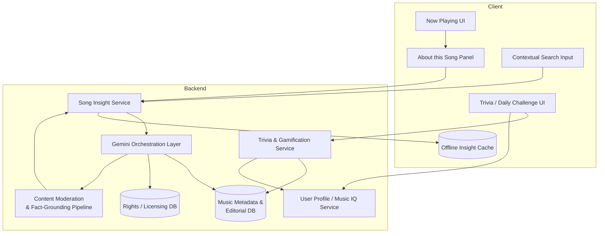

### 2.5.2 Sequence: Contextual Search Q&A

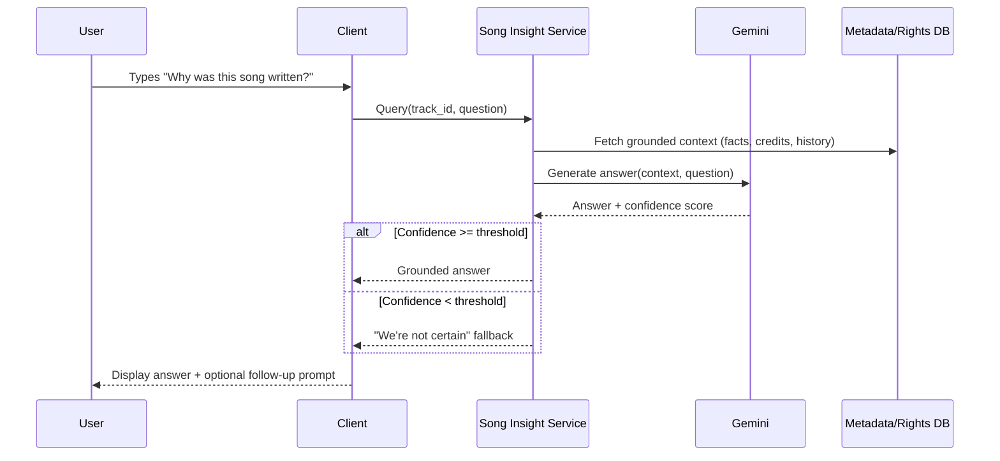

### 2.5.3 Data Model (Key Entities)
```
SongInsight {
  track_id, story, inspiration, genre, recording_history,
  studio, instruments[], producers[], awards[],
  ai_summary_text, ai_summary_generated_at, source_refs[]
}

TriviaCard {
  card_id, track_id, type (fun_fact|award|chart_history|recording_fact), content
}

DailyChallenge {
  challenge_id, date, category (artist|album|lyrics|instrument), question_payload, answer
}

UserGamificationProfile {
  user_id, music_iq_score, music_iq_level, badges[], streak_count, leaderboard_opt_in
}
```

### 2.5.4 Key APIs (Illustrative)
- `GET /v1/insights/{track_id}` → full About this Song payload (cached-friendly, ETag support)
- `POST /v1/insights/{track_id}/ask` `{question, conversation_id}` → grounded Q&A response
- `GET /v1/trivia/daily-challenge?date={date}&tz={tz}`
- `POST /v1/trivia/{challenge_id}/answer` → correctness + IQ delta
- `GET /v1/profile/music-iq` → level, badges, streak

## 2.6 UX Flows

### Flow A: Viewing Song Insights
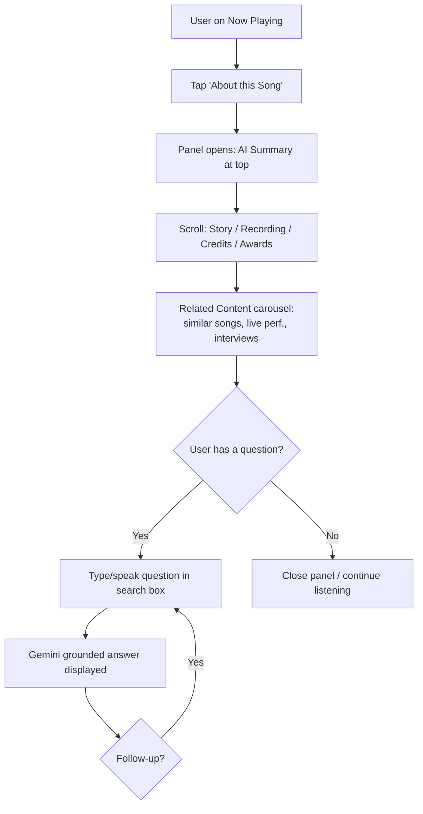

### Flow B: Daily Trivia Challenge
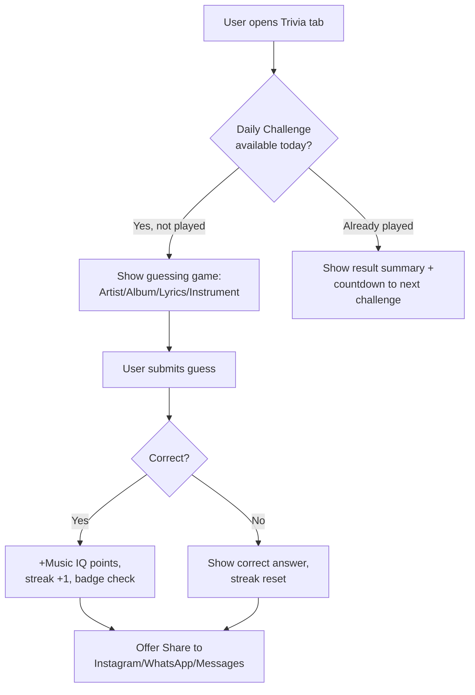

### Screen Inventory
| Screen | Purpose |
|---|---|
| Now Playing > About this Song panel | Core insight content + AI summary |
| Contextual Search box (within panel) | Natural-language Q&A |
| Trivia Tab (top-level nav) | Entry point to daily challenge, cards, leaderboard |
| Music IQ / Profile screen | Level, badges, streak history |
| Share Card generator (modal) | Renders shareable trivia/insight result image |

---

# 3. Pillar 3 — Move Better

## 3.1 Detailed User Stories

### US-3.1: Start an adaptive workout session
**As a** runner
**I want to** start a run and have music automatically adapt to my effort
**So that** I don't have to manage playlists mid-workout.

- **Given** I have connected a supported wearable (Pixel Watch, Fitbit, Garmin, or Wear OS device) via Health Connect
- **When** I start a "Run" activity (auto-detected or manually selected)
- **Then** within 30 seconds the app enters Adaptive Workout Mode and begins a Warmup-phase playlist
- **And** the phase indicator (Warmup/Cardio/Peak/Cooldown) is visible in the player UI

### US-3.2: Phase transition based on heart rate
**As a** cyclist mid-ride
**I want to** have the music intensity increase as my heart rate climbs into a cardio zone
**So that** the music matches my effort.

- **Given** I am in an active Adaptive Workout session
- **When** my heart rate sustains within the "Cardio" zone for the configured window
- **Then** the playlist engine transitions from Warmup to Cardio phase tracks
- **And** the transition uses a crossfade/beat-matched blend, not an abrupt cut

### US-3.3: Emergency Mode triggers on HR spike
**As a** user with a heart condition risk or simply pushing too hard
**I want to** be alerted and have music slow down if my heart rate exceeds a safe threshold
**So that** I'm nudged to recover safely.

- **Given** I am in an active workout session with heart rate monitoring enabled
- **When** heart rate exceeds my configured/derived maximum threshold
- **Then** within 10 seconds the app reduces target BPM of subsequent tracks and shows a "Slow down — recovery recommended" prompt
- **And** the next 1–2 tracks are selected from a lower-BPM recovery pool

### US-3.4: AI Workout DJ continuous generation
**As an** active listener
**I want to** have a continuously generated playlist that factors in my workout, heart rate, time, weather, and mood
**So that** I never hit silence or repeated songs mid-session.

- **Given** I am in an active workout session with AI Workout DJ enabled
- **When** the current track is near ending
- **Then** the next track is pre-selected and pre-buffered based on current inputs (phase, HR, weather, mood, history)
- **And** no track is repeated within the session
- **And** there is no silence gap between tracks

### US-3.5: Connect a wearable
**As a** user
**I want to** connect my Fitbit/Garmin/Pixel Watch
**So that** the app can read my workout and biometric data.

- **Given** I navigate to Settings > Connected Devices
- **When** I select a supported integration (Health Connect, Fitbit, Wear OS, Pixel Watch, Garmin) and complete OAuth/consent
- **Then** the connection status shows "Connected" and required consent scopes are explicitly listed
- **And** I can revoke the connection at any time, immediately stopping data reads

## 3.2 Functional Requirements (Detailed)

| ID | Requirement |
|---|---|
| FR-3.01 | Ingest signals: heart rate, calories, steps, pace, workout type, recovery state via Health Connect, Fitbit, Wear OS, Pixel Watch, Garmin APIs |
| FR-3.02 | Auto-detect workout type: Running, Cycling, Walking, Strength, Yoga (with manual override) |
| FR-3.03 | AI Playlist Engine sequences phases: Warmup → Cardio → Peak → Cooldown, mapped to BPM/energy targets |
| FR-3.04 | Emergency Mode: detect HR threshold breach, reduce target BPM, recommend recovery track/prompt |
| FR-3.05 | AI Workout DJ: continuous generation using workout, HR, time of day, weather, listening history, and mood inputs |
| FR-3.06 | No-repeat guarantee within a session window; no-silence guarantee between tracks |
| FR-3.07 | Smooth/beat-matched transitions between phase changes and track changes |
| FR-3.08 | Explicit consent flow for reading health/biometric data, with visible scope list and revocation control |
| FR-3.09 | On-device or minimally-retained processing of raw biometric streams; only derived signals (zone, phase) persisted beyond session where required |

## 3.3 Non-Functional Requirements (Detailed)

| ID | Category | Requirement |
|---|---|---|
| NFR-3.01 | Latency | Workout detection → Adaptive Mode activation within 30 seconds |
| NFR-3.02 | Safety | Emergency Mode trigger within 10 seconds of threshold breach |
| NFR-3.03 | Reliability | No-silence guarantee: 0 silence gaps > 500ms during active session (measured) |
| NFR-3.04 | Reliability | No-repeat guarantee within configurable session window (default: full session) |
| NFR-3.05 | Compliance | Health data handling compliant with regional regulations (e.g., GDPR health-data category, relevant US health privacy norms); Legal & Privacy sign-off required pre-launch |
| NFR-3.06 | Consent | No biometric data read without explicit, revocable, scoped user consent |
| NFR-3.07 | Interoperability | Support at minimum: Health Connect, Fitbit, Wear OS, Pixel Watch, Garmin at V2 launch |
| NFR-3.08 | Accuracy fallback | If HR data is unreliable/absent, fall back to pace/cadence-derived intensity signals |

## 3.4 Acceptance Criteria Summary

- [ ] Adaptive Mode activates within 30s of workout start across all 5 supported integrations
- [ ] Phase transitions verified smooth (crossfade/beat-matched) in ≥ 95% of test sessions
- [ ] Emergency Mode triggers within 10s in simulated HR-spike test harness, 100% of test cases
- [ ] Zero silence gaps > 500ms and zero in-session repeats across a 500-session automated test suite
- [ ] Consent screen explicitly lists data scopes; revocation immediately halts data reads (verified via integration test)
- [ ] Legal & Privacy review sign-off obtained for all 5 wearable integrations before GA

## 3.5 Technical Architecture

### 3.5.1 Component Overview

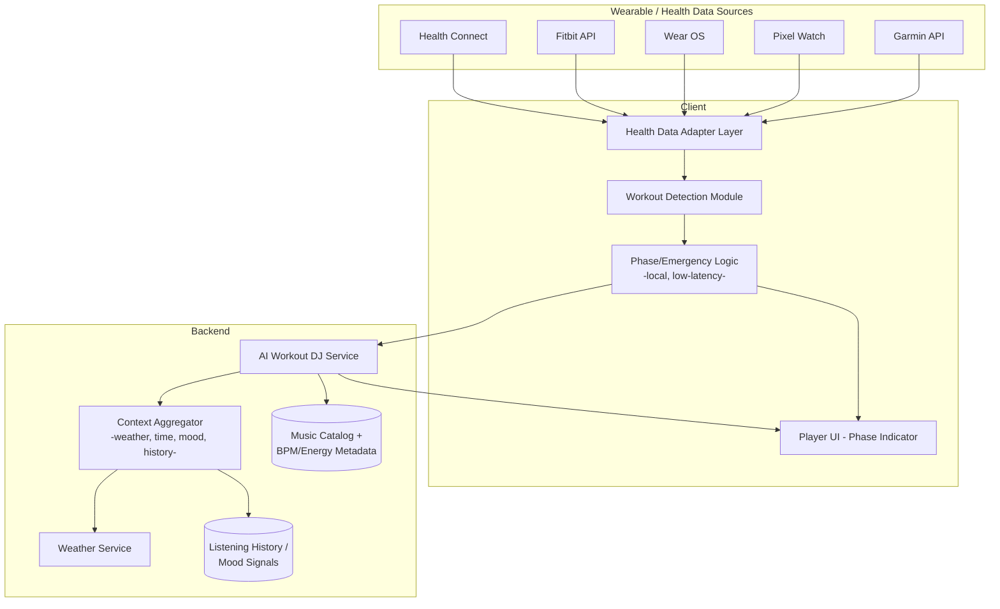

### 3.5.2 Sequence: Emergency Mode Trigger

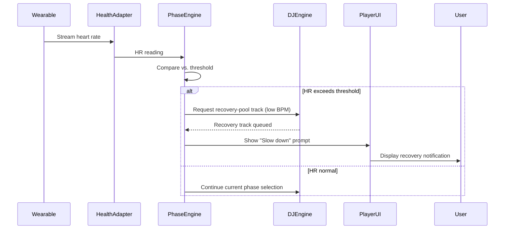

### 3.5.3 Data Model (Key Entities)
```
WorkoutSession {
  session_id, user_id, workout_type, start_time, end_time,
  phase_history: [{phase, start_ts, end_ts}],
  emergency_events: [{ts, hr_value, action_taken}]
}

BiometricSignal {
  session_id, ts, heart_rate, calories, steps, pace, recovery_state
}

PlaylistDecision {
  session_id, track_id, selected_at, reason (phase|emergency|dj_continuous),
  bpm_target, energy_target
}

WearableConnection {
  user_id, provider (health_connect|fitbit|wear_os|pixel_watch|garmin),
  consent_scopes[], connected_at, status
}
```

### 3.5.4 Key APIs (Illustrative)
- `POST /v1/workout/session/start` `{workout_type, source}` → session_id
- `POST /v1/workout/session/{id}/biometric-event` `{hr, calories, steps, pace, ts}`
- `GET /v1/workout/session/{id}/next-track` → DJ Engine decision (track_id, phase, bpm_target)
- `POST /v1/wearables/connect` `{provider}` → OAuth/consent flow
- `DELETE /v1/wearables/connect/{provider}` → revoke consent, halt reads

## 3.6 UX Flows

### Flow A: Starting an Adaptive Workout
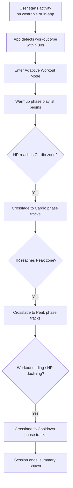

### Flow B: Emergency Mode
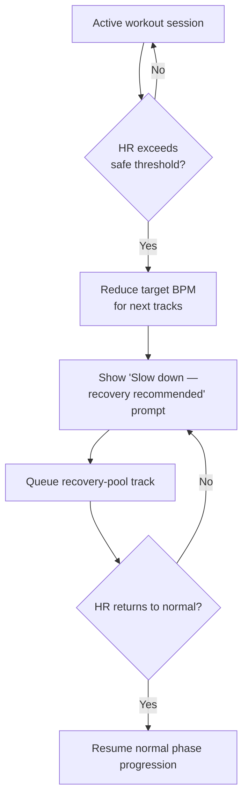

### Screen Inventory
| Screen | Purpose |
|---|---|
| Settings > Connected Devices | Manage wearable integrations, consent, revoke access |
| Workout Player (in-app or Watch companion) | Phase indicator, Emergency Mode prompt, quick controls |
| Post-Workout Summary | Phase breakdown, tracks played, HR-adaptation events |
| Pixel Watch companion UI | Play/pause/skip, current phase glance |

---

# 4. Cross-Cutting — Pixel Integration

## 4.1 Detailed User Stories

### US-4.1: Redeem Premium+ trial on Pixel setup
**As a** new Pixel device owner
**I want to** get 12 months of Premium+ automatically offered during setup
**So that** I can try the premium experience without a separate signup flow.

- **Given** I am completing first-run setup on a new Pixel device
- **When** I reach the services/offers step
- **Then** I see a Premium+ 12-month trial offer with a single-tap "Activate" action
- **And** activation requires only my existing Google account confirmation (no separate payment entry for the trial period)

### US-4.2: Pixel Buds spatial audio + head tracking
**As a** Pixel Buds owner
**I want to** experience spatial audio with head tracking
**So that** supported tracks feel immersive.

- **Given** I am wearing connected Pixel Buds that support spatial audio
- **When** I play a track with spatial audio mix available
- **Then** spatial audio and head tracking activate automatically, with a toggle to disable
- **And** adaptive EQ adjusts based on fit/seal detection

### US-4.3: Pixel Watch workout sync
**As a** Pixel Watch owner
**I want to** control music and see phase/HR status directly from my watch
**So that** I don't need to touch my phone mid-workout.

- **Given** I am in an Adaptive Workout session with a paired Pixel Watch
- **When** I glance at the watch
- **Then** I see current phase, playback controls, and HR reading
- **And** controls (play/pause/skip) sync to the phone session within 1 second

## 4.2 Functional Requirements (Detailed)

| ID | Requirement |
|---|---|
| FR-4.01 | Offer 12-month Premium+ trial during Pixel first-run setup with single-tap activation |
| FR-4.02 | Support spatial audio and head tracking on compatible Pixel Buds |
| FR-4.03 | Support Lossless audio over Pixel Buds where the hardware/codec technically allows |
| FR-4.04 | Adaptive EQ based on fit/seal/environment detection |
| FR-4.05 | Pixel Watch: workout sync, HR display, on-watch playback controls |
| FR-4.06 | Pixel Home Screen widgets: recommendations, workout shortcut, continue listening |

## 4.3 Non-Functional Requirements

| ID | Category | Requirement |
|---|---|---|
| NFR-4.01 | Onboarding friction | Trial activation completes in ≤ 2 taps from setup screen |
| NFR-4.02 | Sync latency | Watch-to-phone playback control sync < 1 second |
| NFR-4.03 | Compatibility | Feature parity validated across current-generation Pixel Buds and Pixel Watch models at launch |

## 4.4 Acceptance Criteria Summary
- [ ] Trial activation flow live in Pixel setup, single confirmation step, tracked via activation funnel analytics
- [ ] Spatial audio/head tracking verified on all compatible Buds models
- [ ] Watch control sync latency < 1s in test harness across Wi-Fi and Bluetooth-only conditions

## 4.5 Technical Architecture

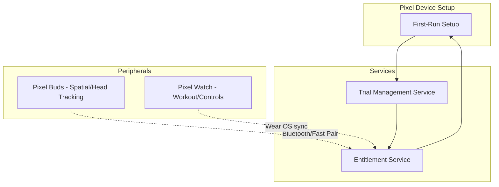

## 4.6 UX Flow

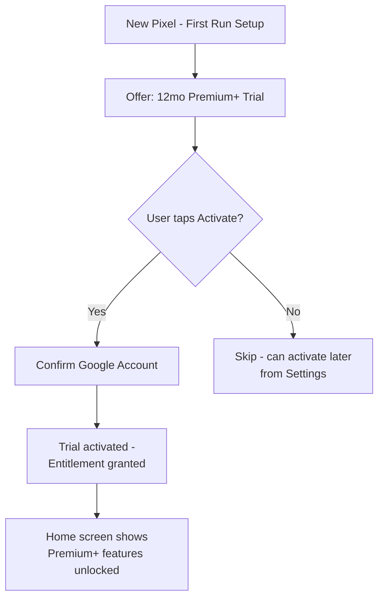

---

# 5. Cross-Cutting — Premium+ Subscription & Entitlements

## 5.1 Detailed User Stories

### US-5.1: Upgrade from Premium to Premium+
**As an** existing Premium subscriber
**I want to** upgrade to Premium+ without cancelling my current subscription
**So that** the transition is frictionless.

- **Given** I am an active Premium subscriber
- **When** I select "Upgrade to Premium+" from account settings
- **Then** I see a feature comparison table and price delta for my region
- **And** upon confirming, my subscription upgrades immediately (or at next billing cycle, per platform policy) without service interruption

### US-5.2: Feature gating by entitlement
**As a** Premium (non-Plus) subscriber
**I want to** see what Premium+ unlocks when I try to access a gated feature
**So that** I understand the upgrade value.

- **Given** I am a Premium (not Premium+) subscriber
- **When** I try to select "Hi-Res" quality or open "About this Song"
- **Then** I see an upgrade prompt explaining the feature is part of Premium+, with a direct upgrade CTA

## 5.2 Functional Requirements (Detailed)

| ID | Requirement |
|---|---|
| FR-5.01 | Entitlement service gates: FLAC/Hi-Res streaming, AI Song Insights, Trivia, Workout DJ, Pixel benefits, listening analytics |
| FR-5.02 | In-app upgrade flow from Premium → Premium+ without requiring cancellation |
| FR-5.03 | Regional pricing support at parity with existing Premium markets |
| FR-5.04 | Feature comparison UI at the upgrade decision point |
| FR-5.05 | Graceful downgrade handling if a user cancels Premium+ (revert to Premium feature set, retain library/downloads metadata) |

## 5.3 Non-Functional Requirements

| ID | Category | Requirement |
|---|---|---|
| NFR-5.01 | Reliability | Entitlement checks resolved in < 200ms to avoid gating latency in playback start path |
| NFR-5.02 | Consistency | Entitlement state consistent across devices within 5 seconds of upgrade/downgrade |
| NFR-5.03 | Billing compliance | Adheres to platform billing policies (Play Billing / App Store) for subscription upgrades |

## 5.4 Acceptance Criteria Summary
- [ ] Upgrade flow completes without requiring re-authentication or cancellation
- [ ] Entitlement propagates to all signed-in devices within 5 seconds
- [ ] Feature-gated entry points show correct upgrade messaging (validated per feature: audio quality, insights, trivia, workout DJ)

## 5.5 Technical Architecture

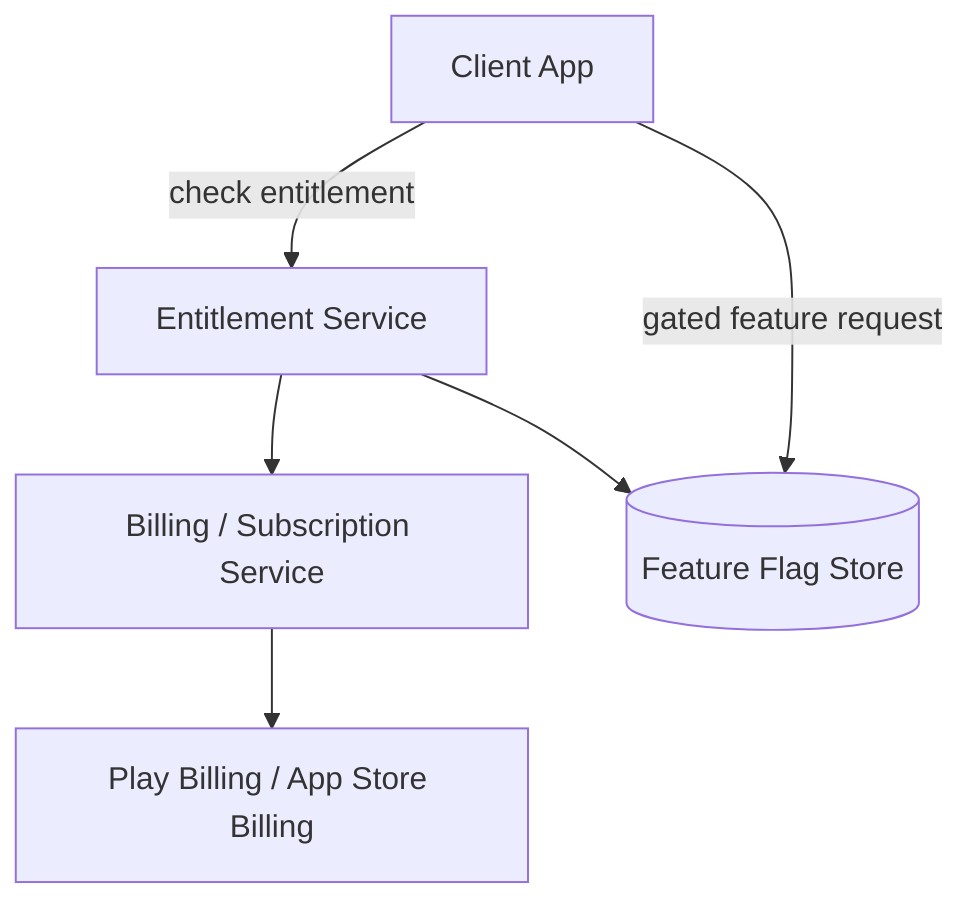

## 5.6 UX Flow

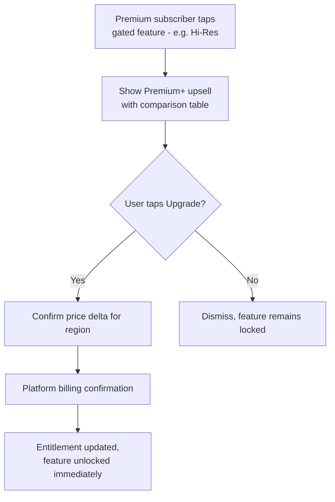

---

# 6. Global Technical Architecture (System Context)

```mermaid
flowchart TB
    subgraph Clients["Client Apps"]
        Mobile[Android / iOS]
        WebApp[Web Player]
        WatchApp[Wear OS / Pixel Watch]
    end

    subgraph Platform["Core Platform Services"]
        Gateway[API Gateway / BFF]
        Entitlement[Entitlement & Billing]
        StreamAPI[Streaming / Manifest Service]
        InsightSvc[Song Insight Service]
        TriviaSvc[Trivia & Gamification]
        WorkoutSvc[Workout / AI DJ Service]
        Telemetry[Telemetry & Analytics]
    end

    subgraph DataAI["Data & AI Layer"]
        Catalog[(Music Catalog)]
        Rights[(Rights / Licensing)]
        Gemini[Gemini AI Services]
        HealthData[(Health/Biometric Store\n- minimized retention -]
    end

    subgraph External["External Integrations"]
        CDN[(Audio CDN)]
        HealthConnect[Health Connect / Fitbit / Garmin]
        Weather[Weather API]
    end

    Mobile --> Gateway
    WebApp --> Gateway
    WatchApp --> Gateway
    Gateway --> Entitlement
    Gateway --> StreamAPI
    Gateway --> InsightSvc
    Gateway --> TriviaSvc
    Gateway --> WorkoutSvc

    StreamAPI --> Catalog
    StreamAPI --> Rights
    StreamAPI --> CDN
    InsightSvc --> Gemini
    InsightSvc --> Catalog
    TriviaSvc --> Catalog
    WorkoutSvc --> HealthConnect
    WorkoutSvc --> Weather
    WorkoutSvc --> HealthData
    WorkoutSvc --> Catalog

    Gateway --> Telemetry
```

---

# 7. Cross-Cutting Non-Functional Requirements

## 7.1 Security
- All API traffic over TLS 1.3+
- Signed, short-lived URLs for CDN audio segment delivery
- OAuth 2.0 / scoped consent for all third-party wearable integrations

## 7.2 Privacy
- Health/biometric data: explicit consent, minimal retention, no use for advertising, regional compliance review (GDPR, and applicable local health-data regulations) before GA
- AI-generated content: source-grounded generation with confidence-based suppression to reduce hallucination risk
- User controls: ability to view, export, and delete stored biometric/workout history

## 7.3 Observability
- Playback quality events (upgrades/downgrades/buffering) logged per session for adaptive engine tuning
- Insight/trivia engagement events logged for success-metric reporting
- Workout session telemetry (phase transitions, emergency triggers) logged with privacy-preserving aggregation

## 7.4 Testing Strategy
| Area | Approach |
|---|---|
| Adaptive audio streaming | Simulated network-throttling test harness (bandwidth drop/recovery scenarios) |
| AI Insights accuracy | Human-reviewed sampling + automated hallucination red-team test set |
| Workout Emergency Mode | Simulated HR-spike test harness with synthetic wearable data |
| Entitlement gating | Cross-device entitlement propagation tests (< 5s target) |
| Pixel integrations | Device-matrix testing across current-gen Buds/Watch models |

---

# 8. Open Implementation Questions
- Which team owns the "recovery track pool" curation for Emergency Mode — Editorial or algorithmic selection?
- What is the fallback UX when a wearable reports HR data with a delay/lag exceeding the 10-second Emergency Mode SLA?
- Should the AI Workout DJ's "mood" input be user-declared (manual selection) or inferred (from recent listening/skip behavior) at V2 launch — or both?
- What is the data retention window for raw biometric streams before they are aggregated/deleted?
